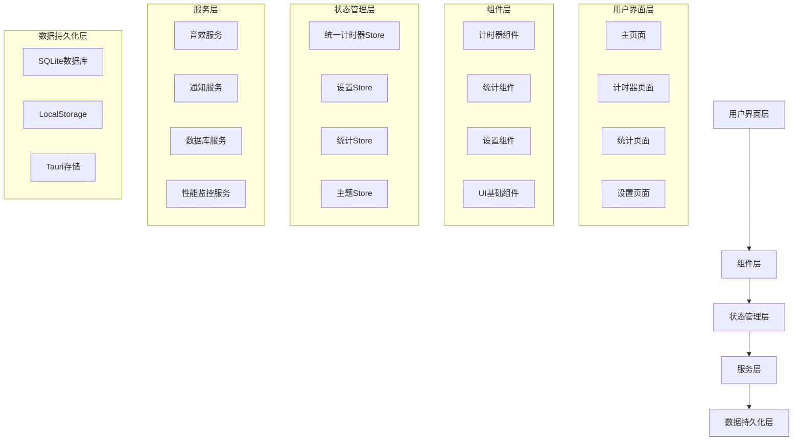

# FocusFlow UI优化与重新设计 - 设计文档

## 概述

本设计文档基于需求分析，为FocusFlow应用制定了全面的UI优化和重新设计方案。设计目标是创建一个现代化、高性能、用户友好的专注时间管理应用，解决现有的构建错误、性能问题和用户体验不足。

## 架构设计

### 整体架构



### 技术栈优化

**前端框架**
- React 18 + TypeScript 5.0
- Zustand (状态管理) - 替代复杂的Redux
- Radix UI (无障碍组件库)
- Tailwind CSS (样式框架)
- Framer Motion (动画库) - 新增

**桌面应用**
- Tauri 1.5 (跨平台框架)
- Rust (后端逻辑)
- SQLite (本地数据库)

**构建工具**
- Vite (快速构建)
- ESLint + Prettier (代码质量)
- Jest (单元测试)

## 组件设计

### 1. 计时器组件重构

#### 1.1 UnifiedTimer组件优化

**设计原则**
- 单一职责：专注于计时器核心功能
- 性能优化：减少不必要的重渲染
- 可访问性：完整的键盘导航和屏幕阅读器支持

**组件结构**
```typescript
interface UnifiedTimerProps {
  onStateChange?: (state: TimerState) => void;
  className?: string;
  compact?: boolean;
  showControls?: boolean;
}

interface TimerState {
  currentState: 'focus' | 'break' | 'microBreak';
  timeLeft: number;
  totalTime: number;
  isActive: boolean;
  progress: number;
}
```

**性能优化策略**
- 使用React.memo包装组件
- 使用useCallback缓存事件处理函数
- 使用useMemo缓存计算结果
- 实现虚拟化长列表（如果需要）

#### 1.2 TimerDisplay组件

**视觉设计**
- 大字体时间显示（最小48px）
- 圆形进度条指示器
- 状态颜色编码（专注-蓝色，休息-红色，微休息-黄色）
- 流畅的动画过渡

**响应式设计**
```css
.timer-display {
  /* 移动端 */
  @media (max-width: 768px) {
    font-size: 3rem;
    padding: 1rem;
  }
  
  /* 桌面端 */
  @media (min-width: 769px) {
    font-size: 4rem;
    padding: 2rem;
  }
  
  /* 高DPI显示器 */
  @media (-webkit-min-device-pixel-ratio: 2) {
    font-weight: 300;
    letter-spacing: -0.02em;
  }
}
```

### 2. 统计组件重构

#### 2.1 Stats组件设计

**数据可视化**
- 使用Recharts库创建图表
- 支持日、周、月视图切换
- 交互式图表（悬停显示详情）
- 导出功能（PDF、CSV）

**图表类型**
- 折线图：专注时间趋势
- 柱状图：每日完成情况
- 饼图：时间分配比例
- 热力图：专注时间分布

#### 2.2 DatabaseStats组件

**功能设计**
- 实时数据库状态监控
- 数据备份和恢复
- 数据清理工具
- 性能指标显示

### 3. 设置组件重构

#### 3.1 UnifiedSettings组件

**设置分类**
```typescript
interface SettingsCategories {
  timer: TimerSettings;
  appearance: AppearanceSettings;
  notifications: NotificationSettings;
  sounds: SoundSettings;
  accessibility: AccessibilitySettings;
  advanced: AdvancedSettings;
}
```

**设计模式**
- 标签页布局
- 实时预览
- 重置到默认值
- 导入/导出配置

## 数据模型设计

### 1. 统一计时器状态

```typescript
interface UnifiedTimerState {
  // 基础状态
  currentMode: TimerMode;
  currentState: 'focus' | 'break' | 'microBreak' | 'forcedBreak';
  timeLeft: number;
  totalTime: number;
  isActive: boolean;
  
  // 会话管理
  sessionStartTime: number;
  focusStartTime: number;
  currentSession: SessionData;
  
  // 智能功能
  nextMicroBreakInterval: number;
  microBreakCount: number;
  continuousFocusTime: number;
  recentEfficiencyScores: number[];
  
  // 统计数据
  todayStats: DailyStats;
  adaptiveAdjustments: AdaptiveSettings;
  
  // UI状态
  showRatingDialog: boolean;
  pendingRatingSession: RatingSession | null;
}
```

### 2. 数据库模式

```sql
-- 会话表
CREATE TABLE sessions (
  id INTEGER PRIMARY KEY AUTOINCREMENT,
  start_time INTEGER NOT NULL,
  end_time INTEGER,
  mode TEXT NOT NULL, -- 'classic' | 'smart'
  focus_time INTEGER DEFAULT 0,
  break_time INTEGER DEFAULT 0,
  micro_breaks INTEGER DEFAULT 0,
  efficiency_score INTEGER,
  created_at INTEGER DEFAULT (strftime('%s', 'now'))
);

-- 每日统计表
CREATE TABLE daily_stats (
  date TEXT PRIMARY KEY,
  total_focus_time INTEGER DEFAULT 0,
  total_break_time INTEGER DEFAULT 0,
  total_micro_breaks INTEGER DEFAULT 0,
  average_efficiency REAL DEFAULT 0,
  sessions_count INTEGER DEFAULT 0,
  updated_at INTEGER DEFAULT (strftime('%s', 'now'))
);

-- 设置表
CREATE TABLE settings (
  key TEXT PRIMARY KEY,
  value TEXT NOT NULL,
  updated_at INTEGER DEFAULT (strftime('%s', 'now'))
);
```

## 用户界面设计

### 1. 设计系统

#### 1.1 颜色方案

**主色调**
```css
:root {
  /* 专注模式 */
  --focus-primary: #3b82f6;
  --focus-secondary: #1d4ed8;
  --focus-light: #dbeafe;
  
  /* 休息模式 */
  --break-primary: #ef4444;
  --break-secondary: #dc2626;
  --break-light: #fee2e2;
  
  /* 微休息模式 */
  --micro-primary: #f59e0b;
  --micro-secondary: #d97706;
  --micro-light: #fef3c7;
  
  /* 中性色 */
  --gray-50: #f9fafb;
  --gray-100: #f3f4f6;
  --gray-900: #111827;
}
```

**深色主题**
```css
[data-theme="dark"] {
  --background: #0f172a;
  --foreground: #f1f5f9;
  --card: #1e293b;
  --card-foreground: #f1f5f9;
  --border: #334155;
}
```

#### 1.2 字体系统

```css
.font-system {
  font-family: -apple-system, BlinkMacSystemFont, 'SF Pro Display', 
               'Segoe UI', 'Roboto', 'Helvetica Neue', Arial, sans-serif;
}

.font-mono {
  font-family: 'SF Mono', Monaco, 'Inconsolata', 'Roboto Mono', 
               'source-code-pro', Menlo, monospace;
}
```

#### 1.3 间距系统

```css
.spacing-system {
  --space-1: 0.25rem;  /* 4px */
  --space-2: 0.5rem;   /* 8px */
  --space-3: 0.75rem;  /* 12px */
  --space-4: 1rem;     /* 16px */
  --space-6: 1.5rem;   /* 24px */
  --space-8: 2rem;     /* 32px */
  --space-12: 3rem;    /* 48px */
  --space-16: 4rem;    /* 64px */
}
```

### 2. 布局设计

#### 2.1 主页面布局

```typescript
interface MainLayoutProps {
  header: React.ReactNode;
  sidebar?: React.ReactNode;
  main: React.ReactNode;
  footer?: React.ReactNode;
}
```

**响应式断点**
- 移动端：< 768px
- 平板端：768px - 1024px
- 桌面端：> 1024px

#### 2.2 计时器页面布局

**桌面端布局**
```
┌─────────────────────────────────────┐
│              Header                 │
├─────────────────┬───────────────────┤
│                 │                   │
│   Timer Display │   Quick Actions   │
│                 │                   │
├─────────────────┼───────────────────┤
│                 │                   │
│   Controls      │   Statistics      │
│                 │                   │
└─────────────────┴───────────────────┘
```

**移动端布局**
```
┌─────────────────┐
│     Header      │
├─────────────────┤
│                 │
│  Timer Display  │
│                 │
├─────────────────┤
│    Controls     │
├─────────────────┤
│  Quick Actions  │
├─────────────────┤
│   Statistics    │
└─────────────────┘
```

### 3. 动画设计

#### 3.1 过渡动画

```css
.transition-smooth {
  transition: all 0.3s cubic-bezier(0.25, 0.46, 0.45, 0.94);
}

.transition-bounce {
  transition: all 0.6s cubic-bezier(0.68, -0.55, 0.265, 1.55);
}
```

#### 3.2 状态变化动画

```typescript
const stateTransitionVariants = {
  focus: {
    backgroundColor: '#3b82f6',
    scale: 1,
    transition: { duration: 0.5 }
  },
  break: {
    backgroundColor: '#ef4444',
    scale: 1.05,
    transition: { duration: 0.5 }
  },
  microBreak: {
    backgroundColor: '#f59e0b',
    scale: 0.95,
    transition: { duration: 0.3 }
  }
};
```

## 错误处理设计

### 1. 错误边界

```typescript
interface ErrorBoundaryState {
  hasError: boolean;
  error: Error | null;
  errorInfo: ErrorInfo | null;
}

class ErrorBoundary extends Component<Props, ErrorBoundaryState> {
  // 错误捕获和恢复逻辑
  static getDerivedStateFromError(error: Error): ErrorBoundaryState {
    return {
      hasError: true,
      error,
      errorInfo: null
    };
  }
  
  componentDidCatch(error: Error, errorInfo: ErrorInfo) {
    // 错误日志记录
    console.error('ErrorBoundary caught an error:', error, errorInfo);
    
    // 发送错误报告（如果启用）
    if (this.props.enableErrorReporting) {
      this.sendErrorReport(error, errorInfo);
    }
  }
}
```

### 2. 异步错误处理

```typescript
const asyncErrorHandler = {
  handleTimerError: (error: Error) => {
    console.error('Timer error:', error);
    // 显示用户友好的错误消息
    showNotification('计时器出现问题，正在尝试恢复...', 'error');
    // 尝试重置计时器状态
    resetTimerState();
  },
  
  handleDatabaseError: (error: Error) => {
    console.error('Database error:', error);
    // 切换到离线模式
    enableOfflineMode();
    showNotification('数据库连接失败，已切换到离线模式', 'warning');
  }
};
```

## 测试策略

### 1. 单元测试

**测试覆盖目标**
- 组件测试：80%+
- 工具函数测试：90%+
- Store测试：85%+
- 服务层测试：75%+

**测试工具**
- Jest (测试框架)
- React Testing Library (组件测试)
- MSW (API模拟)

### 2. 集成测试

```typescript
describe('Timer Integration Tests', () => {
  test('完整的专注会话流程', async () => {
    // 1. 启动计时器
    // 2. 验证状态变化
    // 3. 验证通知发送
    // 4. 验证数据保存
  });
  
  test('模式切换功能', async () => {
    // 1. 切换到智能模式
    // 2. 验证设置更新
    // 3. 验证UI更新
  });
});
```

### 3. 端到端测试

```typescript
// 使用Playwright进行E2E测试
test('用户完整工作流程', async ({ page }) => {
  // 1. 打开应用
  await page.goto('/');
  
  // 2. 启动专注会话
  await page.click('[data-testid="start-timer"]');
  
  // 3. 验证计时器运行
  await expect(page.locator('[data-testid="timer-display"]')).toBeVisible();
  
  // 4. 检查统计更新
  await page.click('[data-testid="stats-tab"]');
  await expect(page.locator('[data-testid="today-stats"]')).toContainText('1');
});
```

## 性能优化策略

### 1. 渲染优化

```typescript
// 使用React.memo优化组件
const TimerDisplay = React.memo(({ time, isActive }: TimerDisplayProps) => {
  return (
    <div className="timer-display">
      {formatTime(time)}
    </div>
  );
}, (prevProps, nextProps) => {
  // 自定义比较函数
  return prevProps.time === nextProps.time && 
         prevProps.isActive === nextProps.isActive;
});

// 使用useMemo缓存计算结果
const formattedStats = useMemo(() => {
  return processStatistics(rawStats);
}, [rawStats]);
```

### 2. 状态管理优化

```typescript
// 使用选择器减少订阅范围
const useTimerTime = () => useUnifiedTimerStore(state => state.timeLeft);
const useTimerActive = () => useUnifiedTimerStore(state => state.isActive);

// 避免在组件中订阅整个store
const TimerComponent = () => {
  const timeLeft = useTimerTime();
  const isActive = useTimerActive();
  // ...
};
```

### 3. 资源优化

```typescript
// 懒加载组件
const StatsPage = lazy(() => import('./pages/StatsPage'));
const SettingsPage = lazy(() => import('./pages/SettingsPage'));

// 音效资源预加载
const preloadSounds = async () => {
  const sounds = ['focus-start', 'break-start', 'micro-break'];
  await Promise.all(sounds.map(sound => loadSound(sound)));
};
```

## 无障碍访问性设计

### 1. 键盘导航

```typescript
const keyboardShortcuts = {
  'Space': () => toggleTimer(),
  'r': () => resetTimer(),
  'Escape': () => closeDialog(),
  'Tab': () => focusNextElement(),
  'Shift+Tab': () => focusPreviousElement()
};
```

### 2. 屏幕阅读器支持

```jsx
<div
  role="timer"
  aria-label={`专注计时器，剩余时间 ${formatTime(timeLeft)}`}
  aria-live="polite"
  aria-atomic="true"
>
  <span className="sr-only">
    {isActive ? '计时器正在运行' : '计时器已暂停'}
  </span>
  {formatTime(timeLeft)}
</div>
```

### 3. 高对比度支持

```css
@media (prefers-contrast: high) {
  .timer-display {
    border: 2px solid currentColor;
    background: var(--background);
    color: var(--foreground);
  }
}

@media (prefers-reduced-motion: reduce) {
  * {
    animation-duration: 0.01ms !important;
    animation-iteration-count: 1 !important;
    transition-duration: 0.01ms !important;
  }
}
```

## 桌面应用集成

### 1. 系统托盘

```rust
// Tauri后端代码
use tauri::{SystemTray, SystemTrayMenu, SystemTrayMenuItem, CustomMenuItem};

fn create_system_tray() -> SystemTray {
    let quit = CustomMenuItem::new("quit".to_string(), "退出");
    let show = CustomMenuItem::new("show".to_string(), "显示");
    let focus = CustomMenuItem::new("focus".to_string(), "开始专注");
    
    let tray_menu = SystemTrayMenu::new()
        .add_item(show)
        .add_item(focus)
        .add_native_item(SystemTrayMenuItem::Separator)
        .add_item(quit);
    
    SystemTray::new().with_menu(tray_menu)
}
```

### 2. 全局快捷键

```rust
use tauri_plugin_global_shortcut::{Code, Modifiers, ShortcutManager};

fn register_global_shortcuts(app: &tauri::App) -> tauri::Result<()> {
    let mut shortcut_manager = app.global_shortcut_manager();
    
    shortcut_manager.register("CmdOrCtrl+Shift+F", || {
        // 触发专注模式
    })?;
    
    shortcut_manager.register("CmdOrCtrl+Shift+B", || {
        // 触发休息模式
    })?;
    
    Ok(())
}
```

### 3. 原生通知

```typescript
import { sendNotification } from '@tauri-apps/api/notification';

const sendNativeNotification = async (title: string, body: string) => {
  try {
    await sendNotification({
      title,
      body,
      icon: '/icon.png'
    });
  } catch (error) {
    console.error('Failed to send notification:', error);
    // 降级到浏览器通知
    if ('Notification' in window) {
      new Notification(title, { body });
    }
  }
};
```

## 部署和构建优化

### 1. 构建配置

```typescript
// vite.config.ts
export default defineConfig({
  plugins: [react()],
  build: {
    target: 'esnext',
    minify: 'terser',
    rollupOptions: {
      output: {
        manualChunks: {
          vendor: ['react', 'react-dom'],
          ui: ['@radix-ui/react-dialog', '@radix-ui/react-tabs'],
          charts: ['recharts']
        }
      }
    }
  },
  optimizeDeps: {
    include: ['react', 'react-dom', 'zustand']
  }
});
```

### 2. Tauri配置

```json
{
  "tauri": {
    "bundle": {
      "identifier": "com.focusflow.app",
      "targets": ["msi", "deb", "dmg"],
      "resources": ["sounds/*", "icons/*"],
      "externalBin": [],
      "copyright": "Copyright © 2025 FocusFlow",
      "category": "Productivity",
      "shortDescription": "专注时间管理应用",
      "longDescription": "基于番茄工作法的现代化专注时间管理桌面应用"
    },
    "security": {
      "csp": "default-src 'self'; style-src 'self' 'unsafe-inline'"
    },
    "windows": [
      {
        "title": "FocusFlow",
        "width": 1200,
        "height": 800,
        "minWidth": 800,
        "minHeight": 600,
        "resizable": true,
        "fullscreen": false
      }
    ]
  }
}
```

## 总结

本设计文档提供了FocusFlow应用全面优化和重新设计的技术方案，涵盖了：

1. **架构重构**：清晰的分层架构和组件设计
2. **UI/UX优化**：现代化设计系统和响应式布局
3. **性能提升**：渲染优化、状态管理优化和资源优化
4. **无障碍支持**：完整的键盘导航和屏幕阅读器支持
5. **桌面集成**：系统托盘、全局快捷键和原生通知
6. **质量保证**：全面的测试策略和错误处理

通过实施这个设计方案，FocusFlow将成为一个高质量、高性能、用户友好的专注时间管理应用。